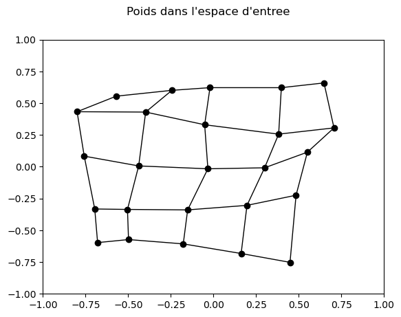
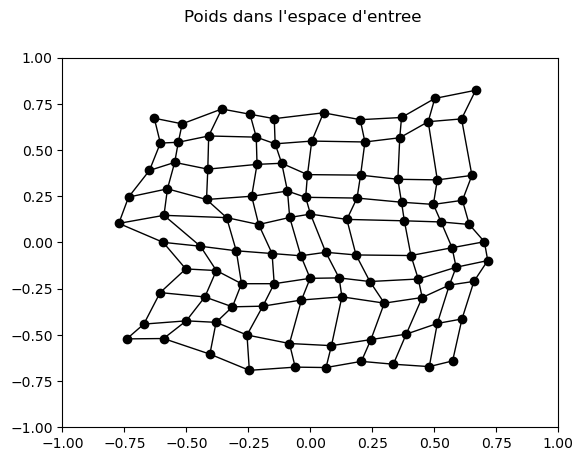

Auteurs :  
Albin Martin  
Julien Salvat

# Intelligence Artificielle - Réseaux de Neurones

## Etude "théorique" de cas simples

### Influence de η 

- η = 0 :  En reprenant la formule : $\Delta w_{ji} = \eta e^{-\frac{\|j - j^*\|_c^2}{2\sigma^2}} (x_i - w_{ji})$  
    On voit que si η = 0, alors $\Delta w_{ji} = 0^{truc}$ = 0, donc la prochaine valeur des poids du neurone j ne changera pas.

- η = 1 :
    On voit que si η = 1, alors $\Delta w_{ji} = 1 * e^{0} (x_i - w_{ji})$, car $\|j - j^*\|_c^2 = 0$, en effet, le neurone j est le neurone gagnant, donc il n'y a pas de distance entre lui et lui-même (j* = j).  
    On a alors $\Delta w_{ji} = 1 * (x_i - w_{ji})$ = $x_i - w_{ji}$.   
    Calculons la nouvelle valeur du poids $W^*_{new}$ :  
    $$W^*_{new} = W^*_{current} + \Delta W^*$$
    En remplaçant $\Delta W^*$ par l'expression que nous venons de trouver (sous forme vectorielle, $\Delta W^* = X - W^*_{current}$) :
    $$W^*_{new} = W^*_{current} + (X - W^*_{current})$$
    $$W^*_{new} = W^*_{current} - W^*_{current} + X$$
    $$W^*_{new} = X$$

    La prochaine valeur des poids du neurone gagnant (W*) sera exactement égale au vecteur d'entrée courant X

- η ∈ ]0,1[ :  
    On voit que si η ∈ ]0,1[, on a de même $\Delta w_{ji} = η * (x_i - w_{ji})$ avec $0 < η < 1$.  
    On a alors : $$W^*_{new} = W^*_{current} + η * (X - W^*_{current})$$
    soit : $$W^*_{new} = (1 - η) * W^*_{current} + η * X$$

    On remarque que la formule correspond à une moyenne pondérée entre le vecteur d'entrée courant X et la valeur courante des poids du neurone gagnant W*. On peut alors dire que : 
    - Si η est proche de 0, la nouvelle valeur des poids sera proche de la valeur courante des poids du neurone gagnant W*.
    - Si η est proche de 1, la nouvelle valeur des poids sera proche du vecteur d'entrée courant X.
    - Si η = 0.5, la nouvelle valeur des poids sera à mi-chemin entre le vecteur d'entrée courant X et la valeur courante des poids du neurone gagnant W*.

- η > 1 : 
    On voit que si η > 1, on a de même : $$W^*_{new} = (1 - η) * W^*_{current} + η * X$$ avec $η > 1$.
    On a alors que (1 - η) < 0, ce qui signifie que W^*_{new} sera en dehors de l'intervalle [W^*_{current}, X]. 
    Cela a pour conséquence que : 
    - le neuronne gagnant dépassera la cible X à chaque itération, et donc il ne convergera pas vers la cible X.
    - les poids oscilleront autour de la cible X, mais ne convergeront pas vers elle.
    - cette divergence peut entraîner une instabilité dans l'apprentissage.

### Influence de σ : 

- Si σ augmente, l'influence du neurone gagnant j* s'étend à un voisinage plus large. Par conséquent, les poids des neurones proches de j* seront davantage modifiés en direction de l'entrée courante, comme le montre l'équation de mise à jour, le terme exponentiel augmente pour ces voisins, ce qui amplifie la variation des poids.
$$\Delta w_{ji} = \eta e^{-\frac{||j - j^*||_c^2}{2\sigma^2}} (x_i - w_{ji})$$  

-  Si σ est plus grand à convergence, σ influence une zone plus large autour du neurone gagnant, donc plus de neurones apprennent l'entrée courante. Un grand σ au début favorise une organisation globale, alors qu'un grand σ à convergence donne une auto-organisation plus lâche.

- Pour quantifier l'influence de σ, on peut utiliser la mesure de la moyenne des distances entre les vecteurs de poids des neurones voisins.  
Cette formule représente la moyenne des distances moyennes entre les voisins de chaque neurone. Pour chaque neuronne de C, on calcule la moyenne du poids entre le neurone parcouru et ses voisins puis additionne les résultats et en fait une moyenne. 

    -   M(σ): Prend σ comme entrée et renvoie une valeur qui représente le "resserrement" des poids des neurones voisins. 
    -   N: L'ensemble des neurones.
    -   V(j): L'ensemble des neurones voisins du neurone j.
    -   P(j): Le poids du neurone j.

$$M(\sigma) = \frac{1}{|\mathcal{N}|} \sum_{j \in \mathcal{N}} \frac{1}{|\mathcal{V}(j)|} \sum_{k \in \mathcal{V}(j)} ||P_j - P_k||$$

Pour conclure, σ contrôle l'étendue de ce voisinage. Une grande valeur de σ signifie qu'un grand nombre de neurones autour du gagnant seront mis à jour, tandis qu'une petite valeur signifie que seuls les neurones très proches seront affectés. De plus, si σ est grand, les neuronnes proches du gagnant vont peu apprendre, alors que si σ est petit, seuls les neurones très proches du gagnant seront mis à jour de manière significative.

### Influence de la distribution d’entrée
#### X1 et X2 présentés autant de fois :
Si X1 et X2 sont présentés autant de fois et avec un η faible et suffisamment de présentations, le neurone va autant apprendre les deux entrées et donc pour minimiser l'erreur, les poids des neurones convergeront vers la moyenne.
$$P = \frac{X_1 + X_2}{2}$$

#### X1 est présenté n fois plus que X2
Il se passe la même chose que précédemment pour les p premières itérations, donc le poid est identique à la moyenne des deux entrées.
Puis, à partir de la n+1 itération, le neurone va apprendre X1 n fois et donc le poids va converger vers X1.
$$P = \frac{X_1 + X_2}{2}$$
$$P = \frac{n \cdot X_1 + X_2}{n + 1}$$

#### Entrées provenant d'une base de données quelconque
Si les entrées proviennent d'une base de données quelconque, la moyenne des entrées va converger vers la moyenne de la base de données.
$$P = \frac{X_1 + X_2 + ... + X_n}{n}$$

#### Carte à plusieurs neurones
Si la carte a plusieurs neurones, ces derniers vont apprendre les entrées de la base de données, et adapter leurs poids pour se rapprocher de ces dernières. De plus, comme un neurone apprend plus des entrées aux poids qui lui sont le plus ressemblants, il finit par se spécialiser dans une certaine région ou un certain motif sur la carte.

Au cours de l'entrainement, les neuronnes vont se répartir de manière à minimiser la distance entre les données d'entrée et les poids des neurones. Ainsi, les neurones auront tendance à se concentrer dans les régions de l'espace d'entrée où la densité de données est la plus élevée. Et comme, plus d'entrées y sont présentées, l'ajustement des poids est plus fréquents dans ces zones de la carte.

La quantification vectorielle permet de mesurer ce phénomène en quantifiant la similarité entre les vecteurs d'entrée et les vecteurs de poids des neurones. Les neurones dont les poids sont les plus proches des données d'entrée seront activés, ce qui permet de regrouper les données similaires en clusters. La distribution des neurones sur la carte reflète donc la distribution des données dans l'espace d'entrée.

# Etude pratique
## Analyse de l’algorithme
### Influence de η :

#### Hypothèse 1

Si η est très petit (proche de 0), alors l'apprentissage sera lent et nécessitera un grand nombre d'itérations pour converger.  

- $\sigma = 0.75$
- $N = 20\,000$
- $\eta = 0.005$

Erreur de quantification moyenne = 0.022052735116966333

#### Hypothèse 2

Si η est grand (plus que 1), l'apprentissage sera rapide initialement, mais à la fin oscillera autour des valeurs optimales, ce qui à long terme diminue la qualité du résultat.
- $\sigma = 0.75$
- $N = 20\,000$
- $\eta = 1$  

Erreur de quantification moyenne = 0.014694036902384567

#### Hypothèse 3

Une valeur de η intermédiaire (entre 0.2 et 0.8) devrait offrir un bon compromis entre vitesse de convergence et stabilité.

- $\sigma = 0.75$
- $N = 20\,000$
- $\eta = 0.5$  

Erreur de quantification moyenne = 0.011177136711844912

#### Confrontation des résultats:
Dans l'ensemble, η = 0.5 est la valeur qui donne le meilleur résultat, car elle permet d'avoir une bonne vitesse de convergence et une bonne précision à la fin de l'apprentissage. Et les hypothèses sont confirmées, car η = 0.005 est trop petit et η = 1 est trop grand.

### Influence de σ :

#### Hypothèse 1

Si σ est très petit au début de l'entraînement, seuls les neurones très proches du neurone gagnant seront significativement mis à jour. Il pourra donc arriver que certains neurones se spécialisent trop rapidement et n'explorent donc pas l'entièreté de l'espace.
- $\eta = 0.5$  
- $N = 20\,000$
- $\sigma = 0.25$

Erreur de quantification moyenne = 0.0084  
M(σ=0.25) = 1.0072
#### Hypothèse 2

Si σ est très grand au début de l'entraînement, l'entraînement impactera un grand nombre de neurones pour chaque entrée, ce qui augmentera le temps d'apprentissage, mais favorisera la répartition des neurones sur la carte. Mais si σ est trop grand, les neurones ne convergeront pas vers les entrées.
- $\eta = 0.5$  
- $N = 20\,000$  
- $\sigma = 3$

Erreur de quantification moyenne = 0.1578  
M(σ=3) = 0.0969
#### Hypothèse 3

Pour obtenir les meilleurs résultats, σ doit avoir une valeur intermédiaire, ou au début avoir une grande valeur, puis diminuer pendant l'entraînement. Cela permet d'abord une organisation à grande échelle, puis un réglage plus fin des poids des neurones, ce qui rendra les résultats plus précis à la fin de l'entraînement.
- $\eta = 0.5$  
- $N = 20\,000$  
- $\sigma = 0.75$ (Valeur intermédiaire)

Erreur de quantification moyenne = 0.0105  
M(σ=0.75) = 0.1828

#### Confrontation des résultats:
Dans l'ensemble, σ = 0.75 est la valeur qui donne le meilleur résultat, car elle permet d'avoir une bonne vitesse de convergence et une bonne précision à la fin de l'apprentissage. Et les hypothèses sont confirmées, car σ = 0.25 est trop petit et σ = 3 est trop grand.
### Influence de N :

#### Hypothèse 1

Si N est trop faible, les neurones peuvent ne pas avoir eu suffisamment d'entraînement, et donc le résultat peut ne pas ressembler au jeu d'entrées.
- $\eta = 0.5$  
- $\sigma = 0.75$  
- $N = 100$

Erreur de quantification moyenne = 0.06676759847880981  Temps=0.06s

#### Hypothèse 2

Si n est trop grand, le temps de calcul peut être excessif et les neurones peuvent trop se spécialiser et ne plus être capables d'apprendre à partir de nouvelles entrées.
- $\eta = 0.5$  
- $\sigma = 0.75$  
- $N = 30\,000$

Erreur de quantification moyenne = 0.012295986026089003  Temps=18.58s

#### Hypothèse 3

Le meilleur résultat est donc obtenu en prenant un N ni trop grand, ni trop petit.
- $\eta = 0.5$  
- $\sigma = 0.75$  
- $N = 5\,000$

Erreur de quantification moyenne = 0.011297272645850752  Temps=3.13s

#### Confrontation des résultats:
Dans l'ensemble, N = 5\,000 est la valeur qui donne le meilleur résultat, car elle permet d'avoir une bonne vitesse de convergence et une bonne précision à la fin de l'apprentissage. Et les hypothèses sont confirmées, car N = 100 est trop petit, la carte n'a pas eu assez d'occasion d'apprendre et N = 30\,000 est trop grand avec un moins bon résultat et un grand temps de calcul.
### Taille et forme de la carte :

#### Hypothèse 1

Si la carte est trop petite, alors il peut ne pas y avoir assez de neurones pour couvrir l'entrée, ce qui donnerait une grande perte d'information.
- $\eta = 0.5$  
- $\sigma = 0.75$  
- $N = 20\,000$  
- $gridsize = (5,\ 5)$ — *Carré*

Erreur de quantification moyenne = 0.04970305593373589
#### Hypothèse 2

Si la carte est trop grande, alors le temps de calcul risque d'être trop grand. Et les points de la carte seront trop rapprochés les uns des autres, ce qui peut entraîner une perte d'information. De plus, si la carte est trop grande, les neurones peuvent se spécialiser trop rapidement et ne pas explorer l'entièreté de l'espace.
- $\eta = 0.5$  
- $\sigma = 0.75$  
- $N = 20\,000$  
- $gridsize = (20,\ 20)$ — *Carré*

Erreur de quantification moyenne = 0.002809332273398752

#### Hypothèse 3

La taille de la carte doit être optimale pour pouvoir représenter au mieux le jeu d'entrées.
- $\eta = 0.5$  
- $\sigma = 0.75$  
- $N = 20\,000$  
- $gridsize = (10,\ 10)$ — *Carré*

Erreur de quantification moyenne = 0.010354177742160645
#### Hypothèse 4

Si la carte est une ligne, alors cette ligne va être courbée pour essayer de recouvrir le plus d'espace ou se rapprocher de la zone la plus dense du jeu de données.

- $\eta = 0.5$  
- $\sigma = 0.75$  
- $N = 20\,000$  
- $gridsize = (1,\ 10)$ — *Ligne horizontale*

Erreur de quantification moyenne = 0.10962186699758192

#### Hypothèse 5

Si la carte est un carré, cette dernière essayera de recouvrir l'ensemble de la carte, mais la plupart des neuronnes seront dans la zone la plus dense.
- $\eta = 0.5$  
- $\sigma = 0.75$  
- $N = 20\,000$  
- $gridsize = (10,\ 10)$ — *Carré*

Erreur de quantification moyenne = 0.010354177742160645

#### Hypothèse 6

Si la carte est un rectangle, cette dernière essayera de recouvrir l'ensemble de la carte, mais la plupart des neuronnes seront dans la zone la plus dense. Ou bien la carte va se courber pour essayer de recouvrir le plus d'espace ou se rapprocher de la zone la plus dense du jeu de données.
- $\eta = 0.5$  
- $\sigma = 0.75$  
- $N = 20\,000$  
- $gridsize = (15,\ 5)$ — *Rectangle 15×5*

Erreur de quantification moyenne = 0.01733269050710892

#### Confrontation des résultats:
Dans l'ensemble, la carte de taille 10x10 est la meilleure, car elle permet d'avoir une bonne vitesse de convergence et une bonne précision à la fin de l'apprentissage. Et les hypothèses sont confirmées, car la carte 5x5 est trop petite et la carte 20x20 est trop grande. La carte en ligne est trop étroite et ne couvre pas assez d'espace. La carte carrée est la plus efficace pour couvrir l'espace d'entrée, tandis que la carte rectangulaire est moins efficace pour un tel jeu de données.

### Influence du jeu de données :

#### Hypothèse 1
Avec une distribution « Plus sur bords », la SOM placera davantage de neurones en périphérie : on s’attend à une couverture plus dense des zones bordures et une meilleure quantification en bordure, au prix d’une sous-représentation du centre.
- $\eta = 0.5$  
- $\sigma = 0.75$  
- $N = 20\,000$ 

Erreur de quantification moyenne = 0.008247854922778304

#### Hypothèse 2  
À l’inverse, une distribution « Plus au centre » concentre la majorité des neurones au centre du plan d’entrée : les bords seront peu ou pas couverts, ce qui génère une erreur locale élevée en périphérie.
- $\eta = 0.5$  
- $\sigma = 0.75$  
- $N = 20\,000$ 

Erreur de quantification moyenne = 0.00972440891013837

#### Hypothèse 3  
Pour une distribution en « Colonnes » (trois bandes de densité variable), la SOM alignera les neurones sur les bandes les plus peuplées. Les colonnes peu denses seront alors sous-représentées, entraînant une quantification imprécise et une erreur locale élevée dans ces zones peu alimentées.
- $\eta = 0.5$  
- $\sigma = 0.75$  
- $N = 20\,000$ 

Erreur de quantification moyenne = 0.010230588340711267

#### Confrontation des résultats:
Dans l'ensemble, les hypothèses sont confirmées, car pour la carte de distribution « Plus sur bords », la carte est étirée sur les bords, ce qui donne une erreur de quantification plus faible. Pour la carte de distribution « Plus au centre », la carte est regroupée au centre, donnant un meilleur résultat. Finalement, pour la carte de distribution « Colonnes », la carte est plus resserrée sur la droite, plus dense, et étirée sur la gauche, ce qui correspond au résultat attendu.

### Bras robotique

#### Question 1
Une fois que la carte de Kohonen a fini son apprentissage, chaque neurone a en mémoire un vecteur de poids qui résume la configuration du bras, avec les angles des moteurs (θ) et la position de la main dans l'espace (x et y).

Si on veut prédire la position de la main du robot grâce aux angles moteurs spécifiques, il suffit de : 
- Trouver dans toute notre carte le neurone dont les angles mémorisés ressemblent le plus à ceux qu'on a donnés. 
- Une fois trouvé, on regarde simplement la position spatiale (x, y) qu'il a apprise

Cela est possible car pendant l'apprentissage, la carte a vu de nombreux exemples et ce neurone a appris l'association la plus fréquente entre ces angles et cette position.

Pour prédire l'inverse, on utilise le même principe. On prend notre position (x, y) cible, et on cherche dans la carte le neurone dont la position spatiale mémorisée est la plus proche de notre cible. Une fois qu'on a ce neurone, on regarde les angles moteurs qu'il a associés à cette position. Ce sont ces angles qu'on va utiliser comme commande. 

Cette méthode permet d'approximer la solution, sans avoir à résoudre des équations compliquées.

#### Conclusion
La carte de Kohonen associe des entrées et des sorties en se basant sur les exemples qu'elle a vus. Quand on lui donne une nouvelle entrée, elle cherche dans sa mémoire la sortie qui lui correspond le mieux. 

#### Question 2
Pour prédire la suite des positions spatiales prises par la main lors d'un déplacement d'une configuration motrice (θ₁, θ₂) à une nouvelle (θ'₁, θ'₂), nous pouvons exploiter la carte de Kohonen apprise.  

Nous devons d'abord identifier sur la carte les neurones qui représentent le mieux nos configurations motrices de départ et d'arrivée. Pour la position initiale (θ₁, θ₂), on trouve le neurone "gagnant" (BMU_initial) dont les composantes de son vecteur de poids sont les plus proches, de même pour la position finale (θ'₁, θ'₂), identifiant ainsi un BMU_final.   

Une fois que nous avons identifié sur la carte les neurones correspondant à nos positions de départ et d'arrivée, on imagine un chemin sur la grille de la carte qui relie ces deux neurones. Ce chemin va passer par une série d'autres neurones intermédiaires sur la carte.   

Pour chaque neurone que l'on croise sur ce chemin, on récupère la position spatiale ( x₁ et x₂) que ce neurone a apprise et mémorisée dans ses poids. A la fin de ce proccessus, on obtient une séquence de points. Cette séquence est notre prédiction de la trajectoire de la main.   

L'idée ici, c'est que la carte de Kohonen s'organise de telle manière que des neurones voisins sur la grille représentent des configurations du bras qui sont elles-mêmes similaires. Donc, se déplacer le long d'un chemin sur la grille de la carte équivaut à une transition progressive et logique entre les configurations du bras. Chaque neurone sur ce chemin nous donne un point de passage spatial appris. Ce n'est pas la trajectoire exacte au millimètre près, car la carte est une approximation, mais cela donne une bonne idée du parcours global et une suite plausible de positions.